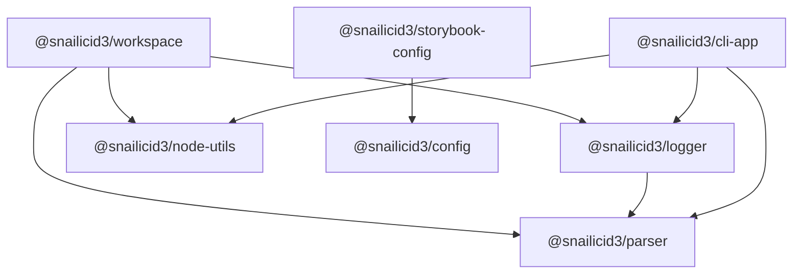

# Snailicid3 Architecture and Refactor Plan

**Status:** official planning baseline · **Date:** 2026-08-12 · **Implementation:** not started

This document replaces the earlier architecture draft. It preserves the useful diagnosis from that
draft, but removes its rejected assumptions about private consumer bins, the parser package, build
ownership, and doctor.

The plan is intentionally decision-led:

- settled decisions are stated as rules
- compatibility-sensitive work is audited before it moves
- unresolved choices remain visibly unresolved
- architecture changes are separated from build-system experiments

---

## 1. Goal

Refactor Snailicid3 so each package has an obvious responsibility without breaking the consumer
repositories that already rely on its public configuration APIs and CLI commands.

The target should make these questions easy to answer:

1. Is this generic Node functionality, repository knowledge, policy, presentation, or command
   execution?
2. Which package owns it?
3. Which public package and command does a consumer install?
4. Can it work without Nx?
5. How is the packed artifact proven correct?

---

## 2. Non-negotiable rules

### 2.1 Preserve public behavior before moving implementations

Every proven public import, bin name, flag, exit behavior, and consumer workflow is a compatibility
contract until an intentional migration replaces it.

An implementation may move only when:

- its published destination exists
- the old entrypoint remains as a compatibility wrapper
- npm and pnpm packed-install tests pass
- the active consumer repositories pass

### 2.2 Organize by what code knows

- **config** knows policy and produces tool configuration.
- **workspace** knows repositories, packages, git state, paths, scopes, and repo operations.
- **node-utils** knows generic Node, filesystem, path, process, and JSON primitives.
- **logger** knows how structured information is presented.
- **parser** knows how argv becomes typed data.
- **cli-app** knows how a polished application behaves.
- **Nx** schedules and caches work; it is not the domain model.

### 2.3 Keep three graphs acyclic

Reciprocal development-tool dependencies are acceptable only when they do not create a reciprocal:

- runtime import graph
- Nx project or task graph
- bootstrap graph

The historical Rollup warning is not a reason to duplicate code or distort package ownership.

### 2.4 Configuration is not execution

Configuration helpers may normalize options and return configuration objects. They must not:

- discover a repository implicitly
- execute Vite, tsdown, Storybook, or another tool
- mutate package.json
- write generated files as a side effect
- decide process exit behavior

Nx targets and workspace commands own execution.

### 2.5 Doctor observes; validate enforces

Doctor is read-only and initially exits successfully after reporting findings. Validate may later
invoke the same collectors and fail CI according to explicit severity policy.

### 2.6 Nx enriches the model but is never required

A single-package, non-Nx repository is treated as a one-package workspace. Package, artifact, and
manifest diagnostics must still work.

### 2.7 Private first-party code must be physically publishable

A public package may be implemented using private workspace modules only if their code and required
assets are actually bundled or copied into the published artifact.

An unpublished workspace dependency must never remain as a rewritten registry dependency in a
tarball. Third-party dependencies are declared normally unless deliberate inlining has a proven
reason.

### 2.8 Do not combine this refactor with a build-system migration

The current build mechanisms remain in place until the ownership refactor, validation, and consumer
tests are complete. A tsc-only experiment may happen later on one simple package.

---

## 3. Target package ownership

| Package                      | Owns                                                                                                                           | Must not own                                               |
| ---------------------------- | ------------------------------------------------------------------------------------------------------------------------------ | ---------------------------------------------------------- |
| @snailicid3/parser           | Lightweight argv normalization and Zod parsing                                                                                 | Logging, help UI, command orchestration, process.exit      |
| @snailicid3/node-utils       | Generic JSON read/write, filesystem and path helpers, filesystem Zod schemas, generic process execution                        | Workspace discovery, git semantics, package ownership      |
| @snailicid3/logger           | Structured logging, tracing, progress, reports, and the snail-sh adapter                                                       | Workspace or build-tool knowledge                          |
| @snailicid3/workspace        | Workspace discovery, package facts, git and affected logic, scope definitions, repo-aware operations, useful repo CLI commands | Lint/build policy                                          |
| @snailicid3/config           | Existing tool-policy APIs, shared formatting policy, tsconfig/docs config, pure build-tool adapters and export planning        | Repository discovery, operational commands, tool execution |
| @snailicid3/cli-app          | Commands, help, versions, formatted errors, prompts, logging integration, and exit handling                                    | Low-level argv tokenization                                |
| @snailicid3/storybook-config | Storybook defaults, framework/addon resolution, and the Storybook config API                                                   | General config policy or repository execution              |
| @snailicid3/build-config     | Temporary compatibility re-exports during migration                                                                            | New permanent responsibilities                             |

The current types, utils, and color layout is not declared permanent by this plan. Keep it stable
during the main refactor, then audit consolidation after the new foundational boundaries are real
and dependency weight can be measured.

### 3.1 Dependency direction



Config may consume a generic node-utils primitive when it genuinely needs filesystem or path data,
but config must not import workspace for discovery.

During the bin migration, config may temporarily declare workspace and logger as package
dependencies solely so its published compatibility wrappers can delegate to their new owners. No
config policy API may use that edge. Remove the temporary dependency when the compatibility window
ends.

### 3.2 Parser versus CLI app

The intended progression is:

- parser accepts argv explicitly and returns typed data
- workspace uses parser for repo utilities
- logger uses parser for snail-sh
- cli-app builds the polished application experience on parser and logger

The parser API stays functional and small. It does not read global argv unless an explicit
convenience function is added, and it does not exit the process.

> **Implementation note:** Use `flaget` for lightweight argv tokenization and Zod 4 for typed
> validation in `@snailicid3/parser`. Reuse the existing `defineEnv(shape)` factory from the other
> project thread in parser: it returns `{ schema, parse, keys }`, maps camel-case names to
> upper-snake environment keys, and `parse(environment)` accepts arbitrary sources such as
> `process.env`, `import.meta.env`, or a test object. Only this factory joins parser; the wider
> environment conventions and project schemas remain in `@snailicid3/config`, and any future
> `process.env` adapter is Node-specific. Use `ansis` for ANSI styling in `@snailicid3/logger`. Keep
> `cli-table3` in the logger reporting/table surface so workspace and doctor can render tables
> without depending on `@snailicid3/cli-app`; verify its ESM compatibility during implementation. A
> consumer hook for extending `snail-sh` with an additional shell script remains an open
> implementation question and must preserve bootstrap behavior.

### 3.3 Node utilities boundary

Good node-utils candidates include:

- JSON file read/write
- filesystem path normalization
- file and directory Zod schemas
- upward file discovery
- generic command spawning

Workspace builds repository meaning on top of those primitives. For example:

- readPackageJson(path) may be node-utils
- getWorkspacePackages() is workspace
- runCommand("git", arguments) may be node-utils
- getChangedWorkspacePackages() is workspace

Config may read data or validate paths with node-utils. A function that mutates a repository because
of configuration belongs in workspace.

---

## 4. Config, workspace, and crossover ownership

The crossover audit is a required refactor step, not evidence that code must be duplicated.

| Surface                   | Config owns                                                | Workspace or execution layer owns                                     |
| ------------------------- | ---------------------------------------------------------- | --------------------------------------------------------------------- |
| Commitlint                | Rules, policy, factory/API, consumption of resolved scopes | Package discovery, file-to-scope matching, overrides                  |
| lint-staged               | Tool policy and file-category configuration                | Repository discovery and changed-file facts                           |
| ESLint                    | Rules, plugins, presets, shared formatting policy          | Any dynamic workspace/package discovery                               |
| Prettier and Markdownlint | Shared width and formatting policy                         | Nothing repository-specific                                           |
| TypeDoc and API Extractor | Pure config APIs                                           | Docs target execution and repository entry discovery                  |
| Nx configuration          | Reusable policy fragments                                  | Resolving projects, rendering/writing files, inspecting target graphs |
| tsdown, Vite, Vitest      | Pure config adapters                                       | Building, watching, and process control                               |
| Knip                      | Shared Knip configuration                                  | Pretty reports, package iteration, doctor aggregation                 |
| Package exports           | Pure expected-export calculation                           | Comparing expected, declared, packed, and emitted reality             |

When a config factory needs repository facts, the root or consumer configuration composes the two
public APIs. Config does not rediscover those facts internally.

---

## 5. Workspace scope contract

Keep the existing commitlint API pattern. Do not add config/commitlint/auto, an optional workspace
peer, or a second consumer setup path.

Use separate input and resolved types so disabled entries cannot leak into commitlint:

```ts
export type WorkspaceScopeOverride = readonly string[] | true | false | undefined

export type WorkspaceScopeDefinition = readonly string[] | true

export type WorkspaceScopeOverrides = Readonly<Record<string, WorkspaceScopeOverride>>

export type WorkspaceScopes = Readonly<Record<string, WorkspaceScopeDefinition>>
```

getWorkspaceScopes() combines:

- discovered packages such as config: ["packages/config/**"]
- standard definitions such as actions: [".github/actions/**", ".github/workflows/**"]
- consumer overrides

Semantics:

| Value                | Meaning                                   |
| -------------------- | ----------------------------------------- |
| readonly string[]    | Valid scope with changed-file matchers    |
| true                 | Valid manual scope without a matcher      |
| false                | Disable a standard or discovered scope    |
| missing or undefined | Inherit the discovered/default definition |
| null                 | Unsupported                               |
| empty array          | Invalid; use true for a matcherless scope |

False is merge input only. Disabled entries are removed from WorkspaceScopes.

Illustrative composition through the existing commitlint factory:

```ts
const scopes = getWorkspaceScopes({
  overrides: {
    root: true,
    docs: false,
  },
})

export default createCommitlintConfig({ scopes })
```

The implementation must use the real current config API name and shape rather than introducing a
parallel naming convention.

---

## 6. Public CLI ownership and compatibility

The old plan's proposal to move consumer commands into private tools and delete config.bin is
rejected.

### 6.1 Destination map

| Existing bin         | Long-term public owner                           | Migration decision                                                               |
| -------------------- | ------------------------------------------------ | -------------------------------------------------------------------------------- |
| snail-sh             | @snailicid3/logger                               | Deduplicate the shell and TypeScript logger; retain a config wrapper temporarily |
| scope-commit         | @snailicid3/workspace                            | Preserve name, flags, and behavior through a config wrapper                      |
| scope-affected       | @snailicid3/workspace                            | Preserve; it is also used by gbt-changeset                                       |
| snail-package        | @snailicid3/workspace                            | Preserve while auditing its package-manager abstraction                          |
| gbt-changeset        | @snailicid3/workspace                            | Treat the user's current revised implementation as authoritative                 |
| inspect-dependencies | @snailicid3/workspace                            | Preserve as the Knip/report command                                              |
| inspect-deps         | @snailicid3/workspace                            | Preserve as an active alias                                                      |
| gbt-setup            | @snailicid3/workspace bootstrap module initially | Preserve; audit shell configuration mutations                                    |
| gbt-uninstall        | @snailicid3/workspace bootstrap module initially | Preserve and harden destructive target resolution                                |
| gbt-patch            | @snailicid3/workspace bootstrap module initially | Preserve command; replace shipped binaries with local build/cache                |
| gbt-exec             | @snailicid3/workspace bootstrap module initially | Preserve until the usage audit supports formal deprecation                       |

Start with internal core, CLI, and bootstrap folders inside the one published workspace package.
Split another public package only if install weight, platform concerns, or bootstrap order provides
concrete evidence that a split helps.

### 6.2 Compatibility wrapper rules

@snailicid3/config keeps every existing bin name during migration.

Each wrapper must:

- resolve its own real path before locating adjacent files
- work when npm exposes the bin through a symlink
- work under pnpm's linked layout
- avoid assuming the current working directory is the package root
- forward arguments and exit status unchanged
- expose a useful error if the delegated implementation is missing

The npm symlink/bootstrap defect must become a regression test, not remain a consumer patch.

### 6.3 Flag and behavior freeze

Before moving code, capture:

- every supported flag and environment variable
- exit codes
- default affected/package behavior
- logging format relied upon by shell callers
- interactions among scope-commit, scope-affected, and gbt-changeset

The current disagreement around --skip-lint-staged must be resolved from consumer behavior before
the parser rewrite. Do not silently reject a flag still used by active repositories.

Apply the user's pending gbt-changeset changes before recording its golden behavior.

### 6.4 Known consumer matrix

The migration test matrix begins with:

- gbt-template-boilerplate
- gbt-schema-form
- gbt-monorepo2
- Temporal Viewer
- npm-vite-nightmare-example
- snailicid3-consumer-npm
- Pyromancy
- Snailicid3 itself

Add every further call site found by the Phase 0 audit.

---

## 7. gbt-patch and the esbuild binary

Do not publish or retain the 28 MB prebuilt binary payload.

The replacement behavior is:

1. Determine the required esbuild version, patch revision, platform, and architecture.
2. Build the patched binary locally only when the matching cache entry is absent.
3. Cache it beneath a temp-directory path keyed by all four values.
4. Validate a completion marker or checksum before reuse.
5. Replace the target binary only after a successful build.
6. Remain idempotent.

The cache may live under /tmp because the user accepts rebuilding after it is cleared. The command
should allow a future cache-root override without making that part of the first implementation.

Removing the shipped binaries and narrowing package files happens only after the replacement command
passes packed npm and pnpm tests.

GitHub Release assets are not part of the selected design.

---

## 8. Build configuration

### 8.1 Build helpers join the existing config API family

The current build-plan, tsdown, Vite, and Vitest transformations are primarily configuration
helpers. Their target home is @snailicid3/config, using the same definition/merge API style as the
other tools.

Illustrative surface:

```ts
const build = Build.plan({
  entries: ['src/index.ts'],
})

export default Tsdown.config({ build })
```

Exact names follow the existing config API conventions after the code audit.

### 8.2 BuildPlan is not repository truth

A small plan may remain useful for composing tool configurations and calculating expected outputs.
It is not:

- required by doctor
- a replacement for resolved Nx targets
- package metadata
- a second build graph
- the authoritative declaration of product or runtime

Doctor derives a ResolvedBuild report from observed configuration, targets, manifests, and
artifacts.

### 8.3 Remove execution and mutation

- Remove viteAdapter.build() or move execution to an Nx/workspace command.
- Do not let tsdown mutate package.json exports.
- Preserve the existing toPackageExportsPlan() capability as a pure report of expected exports;
  align its name later only through the normal config API migration.
- Move Publint and ATTW out of tsdown options.
- Omit tsdown's unused check initially because Knip already covers that domain; retain it only if
  tests show unique findings.

### 8.4 build-config compatibility

Active consumers of @snailicid3/build-config migrate gradually.

The package becomes a compatibility facade that re-exports the new config APIs, emits deprecation
guidance only when appropriate, and gains no new domain behavior. Remove it only through an
intentional versioned migration.

---

## 9. Storybook configuration

Storybook follows the same API style but stays in a separate public package because its dependency
stack is unusually large.

@snailicid3/storybook-config:

- imports generic API-definition and merge helpers from @snailicid3/config
- declares the required Storybook framework and addons as normal dependencies
- resolves framework/addon paths internally with import.meta.resolve()
- hides repetitive package-name strings from consumers
- exposes project-specific overrides

Consumers add one dev dependency and keep thin .storybook/main.ts, preview.ts, and manager.ts files
where applicable for local choices such as stories, preview parameters, and manager settings.

Do not use:

- regular optionalDependencies, because they still install by default
- optional peers as an attempt to hide the required install
- Storybook dependencies in core config
- bundling Storybook itself

The static Storybook target is an auxiliary build, not the package's primary build.

---

## 10. Doctor and validate

### 10.1 Doctor does not require BuildPlan or Nx

Doctor starts from package and artifact reality. Nx adds higher-confidence topology when present.

### 10.2 Package-first diagnostics

These work in Nx and non-Nx repositories:

- package.json, exports, files, bin, types, engines, and dependency checks
- expected exports compared with declared and emitted files
- packed package contents
- executable-bin and declaration existence
- observed tsdown/Vite strategy
- Publint
- ATTW
- Knip source, export, file, and dependency analysis
- generic npm or pnpm workspace discovery

Build strategy is a single observed classification:

```ts
type BuildStrategy = 'bundle' | 'transpile' | 'none'
```

Bundling already implies transpilation, so separate bundled and transpiled booleans are rejected.

### 10.3 Nx enrichment

When Nx is detected, doctor may add:

- resolved inferred targets plus targetDefaults and project overrides
- dependsOn, inputs, outputs, and cache analysis
- project and task graph inspection
- primary-build reachability
- auxiliary-build discovery
- affected analysis
- tag-based dependency-boundary checks

Without Nx, script/config inference is clearly labeled inferred rather than resolved.

### 10.4 Target categories

| Category         | Meaning                                              | Examples                                   |
| ---------------- | ---------------------------------------------------- | ------------------------------------------ |
| Primary build    | Artifact targets reachable from canonical build      | tsdown, Vite library/app build, tsc output |
| Auxiliary build  | Artifact-producing targets outside the primary chain | Storybook static, docs build, demo build   |
| Validation       | Checks source or built output                        | test, Knip, Publint, ATTW                  |
| Serve or publish | Long-running or external delivery                    | Storybook dev, Chromatic, deployment       |

An auxiliary target is not residual merely because canonical build does not depend on it.

### 10.5 Tags versus metadata

- Use runtime:node, runtime:browser, or runtime:universal Nx tags when dependency rules can enforce
  them.
- Infer product from bins, exports, targets, and configs when reliable.
- Infer BuildStrategy from resolved configuration and artifacts.
- Use custom project or target metadata only as an override for genuinely ambiguous intent.
- Do not record the same fact in both tags and custom metadata.

### 10.6 Report before enforcement

Doctor initially:

- performs no fixes
- performs no package mutation
- exits successfully even when reporting problems
- distinguishes observed facts, inference, and explicit intent

Validate later invokes selected collectors with severity policy and a CI-failing exit code.

---

## 11. Publishing and acceptance tests

Every public package change is tested from its packed tarball rather than a workspace link.

### 11.1 Package checks

- pack the exact public artifact
- assert intended files are included and private/source artifacts are excluded
- test every declared export condition
- typecheck under the resolution modes the package claims to support
- execute every public bin
- test clean install under npm and pnpm
- test bin symlink resolution
- confirm no unresolved private workspace dependency exists

### 11.2 Real consumer checks

Run the known consumer matrix against packed or published candidate packages. Workspace links are
insufficient because they can hide files, exports, dependency, and bin failures.

No config wrapper or legacy flag is removed until the consumer audit proves it unused or a
documented migration is complete.

---

## 12. Implementation sequence

Each phase has a checkpoint. Do not begin the next structural phase while its compatibility tests
are red.

### Phase 0 — Freeze and audit the current contract

- Inventory every config import and all 11 bin names across Snailicid3 and consumers.
- Capture flags, environment variables, exit codes, and wrapper behavior.
- Incorporate the user's pending gbt-changeset changes.
- Reproduce the npm symlink/bootstrap failure in a fixture.
- Audit config/workspace crossover surfaces listed in Section 4.
- Audit build-config consumers before moving exports.
- Record current packed contents and dependency weight.

**Done when:** the compatibility matrix is executable and no move depends on memory.

### Phase 1 — Fix the urgent binary packaging defect

[x] COMPLETE!!

- Implement local build and temp-cache behavior for gbt-patch.
- Add platform, architecture, version, and patch-revision cache keys.
- Test clean, cached, failed, and repeated runs.
- Remove prebuilt payloads from the packed package only after the replacement passes.

**Done when:** consumers retain gbt-patch without receiving the 28 MB payload.

### Phase 2 — Establish foundational packages

- Create @snailicid3/parser with Zod-based typed parsing.
- Move generic Node JSON, path, filesystem-schema, and process primitives into node-utils.
- Keep functional APIs and explicit argv inputs.
- Migrate one internal caller at a time with tests.

**Done when:** parser and node-utils have clear tests and no workspace knowledge.

### Phase 3 — Consolidate logger and snail-sh

- Make snail-sh the shell-facing adapter to the real logger.
- Use parser for its arguments.
- Preserve only the smallest dependency-free shell floor required before built JavaScript exists.
- Pack and test the logger bin under npm and pnpm.
- Add a config compatibility wrapper.

**Done when:** normal logging semantics exist in one implementation without breaking bootstrap.

### Phase 4 — Create the public workspace package

- Move repo roots, package discovery, paths, git, affected logic, ownership, and scope matching.
- Add the exact getWorkspaceScopes() contract.
- Migrate commitlint composition without changing its established API.
- Move lint-staged/ESLint/Nx/TypeDoc discovery only where the crossover audit proves it belongs.
- Keep Nx integration optional.

**Done when:** workspace works in both a monorepo and a single-package non-Nx fixture.

### Phase 5 — Move repo commands and preserve config bins

- Move repo-aware implementations into workspace core/CLI/bootstrap modules.
- Keep every current config bin as a thin compatibility wrapper.
- Fix npm symlink resolution.
- Freeze or intentionally migrate all flags.
- Run the full consumer matrix.

**Done when:** consumers can use old config commands and new owner-package commands with equivalent
behavior.

### Phase 6 — Reframe build configuration

- Move pure Build, tsdown, Vite, Vitest, and export-plan helpers into the config API family.
- Remove build execution and manifest mutation.
- Convert build-config into a compatibility facade.
- Keep existing build mechanisms unchanged.

**Done when:** config returns configuration only, Nx/workspace executes it, and active build-config
consumers pass.

### Phase 7 — Add Storybook configuration

- Create the separate Storybook config package.
- Resolve framework/addon packages internally.
- Keep consumer .storybook entry files thin.
- Identify static Storybook targets as auxiliary builds.

**Done when:** a component consumer installs one Snailicid3 Storybook dev dependency and builds
Storybook successfully.

### Phase 8 — Implement doctor, then validate

- Build package-first collectors.
- Add the optional Nx collector.
- Integrate Knip, export comparison, Publint, and ATTW without mutation.
- Run doctor in report-only mode.
- Add validate severity policy only after report output is trustworthy.

**Done when:** the npm single-package consumer receives useful diagnostics and Nx repositories
receive additional resolved graph analysis.

### Phase 9 — Full packed-consumer checkpoint

- Pack every public package.
- Run npm and pnpm fixtures.
- Run the real consumer matrix.
- Inspect install weight and dependency direction.
- Decide whether any temporary wrapper or package can now be retired.

**Done when:** the architecture can be explained by the ownership table, and the published artifacts
prove it.

---

## 13. Explicitly rejected directions

Do not silently revive these in implementation:

- moving proven consumer bins into private-only tools
- deleting config.bin before a tested compatibility migration
- naming the lightweight package argv instead of @snailicid3/parser
- putting lightweight parsing under cli-app/parser
- config/commitlint/auto or optional-peer discovery
- requiring BuildPlan or Nx for doctor
- letting build adapters execute tools or mutate package exports
- shipping the esbuild binaries or requiring GitHub Release assets
- installing Storybook through optionalDependencies in config
- treating types and color as permanently separate without the later consolidation audit
- making a repository-wide tsc-only migration part of this refactor

---

## 14. Open questions

These remain open deliberately:

1. What are the user's final gbt-changeset changes?
2. Should --skip-lint-staged be restored, translated to the current environment-variable behavior,
   or formally migrated?
3. Does gbt-exec have an unobserved consumer, or can it enter a deprecation window?
4. How long should config bin wrappers remain, and which release boundary permits their removal?
5. Does the workspace bootstrap module eventually justify a separate public package?
6. Which Storybook frameworks/presets require supported variants?
7. Does BuildPlan keep its current name after its responsibility is reduced?
8. Is scaffold intentionally gone, and is example-package a fixture, template, or residue?
9. After the main refactor, should types and color remain packages or become lighter
   subpaths/modules?
10. Which custom doctor finding, if any, is not already covered by Knip, Publint, ATTW, packed
    tests, or Nx?

No open question permits breaking an existing consumer while it is being answered.

---

## 15. Completion criteria

The refactor is complete when:

- each reusable capability has one clear owner
- config APIs remain cohesive and non-operational
- workspace supports Nx and non-Nx repositories
- parser is reusable by workspace, logger, and cli-app
- snail-sh has one normal implementation
- every proven public bin remains available through a tested migration
- no prebuilt esbuild payload ships
- build configuration is pure and package exports are not mutated
- Storybook has an isolated dependency boundary
- doctor reports reality without mutation
- validate, packed fixtures, and real consumers pass
- no runtime, Nx-task, or bootstrap cycle has been introduced
