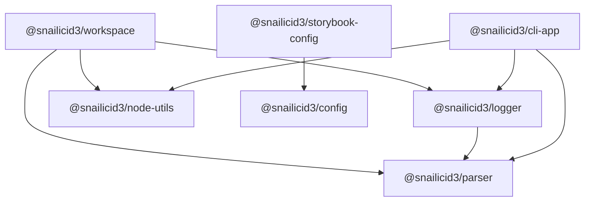

# Snailicid3 Architecture and Refactor Plan

**Status:** in progress · **Date:** 2026-08-12 · **Implementation:** Phases 0–5 largely landed.
Phase 6 (config-ownership cleanup) is **complete** — the JSON file-IO/glob/path moves (config →
node-utils), the pure JSON value layer (`json-value` → `@snailicid3/utils`, double-serialize bug
fixed), the node-utils→utils value delegation (the **JSON domain now has one value
implementation**), `exportFile` tightened to require a JSON document, config depending on node-utils
only, and the `shared/` formatting regroup are all done. cli-app re-exports from node-utils.
`build-exporter.ts` stays because its generated JSON files are a published config export. Phase 7
(branch-aware changeset/release workflow, [#201]) is the closing phase of this round and is not
started.

This document replaces the earlier architecture draft. It preserves the useful diagnosis from that
draft, but removes its rejected assumptions about private consumer bins, the parser package, build
ownership, and doctor.

The plan is intentionally decision-led:

- settled decisions are stated as rules
- compatibility-sensitive work is audited before it moves
- unresolved choices remain visibly unresolved
- architecture changes are separated from build-system experiments

## Scope boundary — this round pauses after Phase 7

The refactor is deliberately split into two tracks so the ownership work can land and be released
without waiting on a build-system rewrite.

- **Part A — foundational ownership refactor (this round).** Phases 0–7. It ends when package
  ownership is correct, config is non-operational, the public bins remain compatible, the config
  utility cleanup is finished (Phase 6), and the branch-aware changeset/release workflow ([#201],
  Phase 7) is in place. **This round stops after Phase 7; it does not begin the build-system
  track.**
- **Part B — build-system & tooling initiative (separate, deferred).** The former Phases 6–9 —
  reframing build configuration, the Storybook package, and doctor/validate — move into their own
  effort with their own plan. None of it is required to complete Part A, and none of it blocks a
  release of the Part A ownership boundaries. It is retained at the end of this document for
  continuity but is **not** in scope for this round.

[#201]: https://github.com/gbtunney/snailicid3/issues/201

---

## 1. Goal

Refactor Snailicid3 so each package has an obvious responsibility without breaking the consumer
repositories that already rely on its public configuration APIs and CLI commands.

The target should make these questions easy to answer:

1. Is this generic Node functionality, repository knowledge, policy, presentation, or command
   execution?
2. Which package owns it?
3. Which public package and command does a consumer install?
4. Can it work without Nx?
5. How is the packed artifact proven correct?

---

## 2. Non-negotiable rules

### 2.1 Preserve public behavior before moving implementations

Every proven public import, bin name, flag, exit behavior, and consumer workflow is a compatibility
contract until an intentional migration replaces it.

An implementation may move only when:

- its published destination exists
- the old entrypoint remains as a compatibility wrapper
- npm and pnpm packed-install tests pass
- the active consumer repositories pass

### 2.2 Organize by what code knows

- **config** knows policy and produces tool configuration.
- **workspace** knows repositories, packages, git state, paths, scopes, and repo operations.
- **node-utils** knows generic Node, filesystem, path, process, and JSON primitives.
- **logger** knows how structured information is presented.
- **parser** knows how argv becomes typed data.
- **cli-app** knows how a polished application behaves.
- **Nx** schedules and caches work; it is not the domain model.

### 2.3 Keep three graphs acyclic

Reciprocal development-tool dependencies are acceptable only when they do not create a reciprocal:

- runtime import graph
- Nx project or task graph
- bootstrap graph

The historical Rollup warning is not a reason to duplicate code or distort package ownership.

### 2.4 Configuration is not execution

Configuration helpers may normalize options and return configuration objects. They must not:

- discover a repository implicitly
- execute Vite, tsdown, Storybook, or another tool
- mutate package.json
- write generated files as a side effect
- decide process exit behavior

Nx targets and workspace commands own execution.

### 2.5 Doctor observes; validate enforces

Doctor is read-only and initially exits successfully after reporting findings. Validate may later
invoke the same collectors and fail CI according to explicit severity policy.

### 2.6 Nx enriches the model but is never required

A single-package, non-Nx repository is treated as a one-package workspace. Package, artifact, and
manifest diagnostics must still work.

### 2.7 Private first-party code must be physically publishable

A public package may be implemented using private workspace modules only if their code and required
assets are actually bundled or copied into the published artifact.

An unpublished workspace dependency must never remain as a rewritten registry dependency in a
tarball. Third-party dependencies are declared normally unless deliberate inlining has a proven
reason.

### 2.8 Do not combine this refactor with a build-system migration

The current build mechanisms remain in place until the ownership refactor, validation, and consumer
tests are complete. A tsc-only experiment may happen later on one simple package.

---

## 3. Target package ownership

| Package                      | Owns                                                                                                                           | Must not own                                               |
| ---------------------------- | ------------------------------------------------------------------------------------------------------------------------------ | ---------------------------------------------------------- |
| @snailicid3/parser           | Lightweight argv normalization and Zod parsing                                                                                 | Logging, help UI, command orchestration, process.exit      |
| @snailicid3/node-utils       | Generic JSON read/write, filesystem and path helpers, filesystem Zod schemas, generic process execution                        | Workspace discovery, git semantics, package ownership      |
| @snailicid3/logger           | Structured logging, tracing, progress, reports, and the snail-sh adapter                                                       | Workspace or build-tool knowledge                          |
| @snailicid3/workspace        | Workspace discovery, package facts, git and affected logic, scope definitions, repo-aware operations, useful repo CLI commands | Lint/build policy                                          |
| @snailicid3/config           | Existing tool-policy APIs, shared formatting policy, tsconfig/docs config, pure build-tool adapters and export planning        | Repository discovery, operational commands, tool execution |
| @snailicid3/cli-app          | Commands, help, versions, formatted errors, prompts, logging integration, and exit handling                                    | Low-level argv tokenization                                |
| @snailicid3/storybook-config | Storybook defaults, framework/addon resolution, and the Storybook config API                                                   | General config policy or repository execution              |
| @snailicid3/build-config     | Temporary compatibility re-exports during migration                                                                            | New permanent responsibilities                             |

The current types, utils, and color layout is not declared permanent by this plan. Keep it stable
during the main refactor, then audit consolidation after the new foundational boundaries are real
and dependency weight can be measured.

### 3.1 Dependency direction



Config may consume a generic node-utils primitive when it genuinely needs filesystem or path data,
but config must not import workspace for discovery.

During the bin migration, config may temporarily declare workspace and logger as package
dependencies solely so its published compatibility wrappers can delegate to their new owners. No
config policy API may use that edge. Remove the temporary dependency when the compatibility window
ends.

### 3.2 Parser versus CLI app

The intended progression is:

- parser accepts argv explicitly and returns typed data
- workspace uses parser for repo utilities
- logger uses parser for snail-sh
- cli-app builds the polished application experience on parser and logger

The parser API stays functional and small. It does not read global argv unless an explicit
convenience function is added, and it does not exit the process.

> **Implementation note:** Use `flaget` for lightweight argv tokenization and Zod 4 for typed
> validation in `@snailicid3/parser`. Reuse the existing `defineEnv(shape)` factory from the other
> project thread in parser: it returns `{ schema, parse, keys }`, maps camel-case names to
> upper-snake environment keys, and `parse(environment)` accepts arbitrary sources such as
> `process.env`, `import.meta.env`, or a test object. Only this factory joins parser; the wider
> environment conventions and project schemas remain in `@snailicid3/config`, and any future
> `process.env` adapter is Node-specific. Use `ansis` for ANSI styling in `@snailicid3/logger`. Keep
> `cli-table3` in the logger reporting/table surface so workspace and doctor can render tables
> without depending on `@snailicid3/cli-app`; verify its ESM compatibility during implementation. A
> consumer hook for extending `snail-sh` with an additional shell script remains an open
> implementation question and must preserve bootstrap behavior.

### 3.3 Node utilities boundary

Good node-utils candidates include:

- JSON file read/write
- filesystem path normalization
- file and directory Zod schemas
- upward file discovery
- generic command spawning

Workspace builds repository meaning on top of those primitives. For example:

- readPackageJson(path) may be node-utils
- getWorkspacePackages() is workspace
- runCommand("git", arguments) may be node-utils
- getChangedWorkspacePackages() is workspace

Config may read data or validate paths with node-utils. A function that mutates a repository because
of configuration belongs in workspace.

---

## 4. Config, workspace, and crossover ownership

The crossover audit is a required refactor step, not evidence that code must be duplicated.

| Surface                   | Config owns                                                | Workspace or execution layer owns                                     |
| ------------------------- | ---------------------------------------------------------- | --------------------------------------------------------------------- |
| Commitlint                | Rules, policy, factory/API, consumption of resolved scopes | Package discovery, file-to-scope matching, overrides                  |
| lint-staged               | Tool policy and file-category configuration                | Repository discovery and changed-file facts                           |
| ESLint                    | Rules, plugins, presets, shared formatting policy          | Any dynamic workspace/package discovery                               |
| Prettier and Markdownlint | Shared width and formatting policy                         | Nothing repository-specific                                           |
| TypeDoc and API Extractor | Pure config APIs                                           | Docs target execution and repository entry discovery                  |
| Nx configuration          | Reusable policy fragments                                  | Resolving projects, rendering/writing files, inspecting target graphs |
| tsdown, Vite, Vitest      | Pure config adapters                                       | Building, watching, and process control                               |
| Knip                      | Shared Knip configuration                                  | Pretty reports, package iteration, doctor aggregation                 |
| Package exports           | Pure expected-export calculation                           | Comparing expected, declared, packed, and emitted reality             |

When a config factory needs repository facts, the root or consumer configuration composes the two
public APIs. Config does not rediscover those facts internally.

---

## 5. Workspace scope contract

Keep the existing commitlint API pattern. Do not add config/commitlint/auto, an optional workspace
peer, or a second consumer setup path.

Use separate input and resolved types so disabled entries cannot leak into commitlint:

```ts
export type WorkspaceScopeOverride = readonly string[] | true | false | undefined

export type WorkspaceScopeDefinition = readonly string[] | true

export type WorkspaceScopeOverrides = Readonly<Record<string, WorkspaceScopeOverride>>

export type WorkspaceScopes = Readonly<Record<string, WorkspaceScopeDefinition>>
```

getWorkspaceScopes() combines:

- discovered packages such as config: ["packages/config/**"]
- standard definitions such as actions: [".github/actions/**", ".github/workflows/**"]
- consumer overrides

Semantics:

| Value                | Meaning                                   |
| -------------------- | ----------------------------------------- |
| readonly string[]    | Valid scope with changed-file matchers    |
| true                 | Valid manual scope without a matcher      |
| false                | Disable a standard or discovered scope    |
| missing or undefined | Inherit the discovered/default definition |
| null                 | Unsupported                               |
| empty array          | Invalid; use true for a matcherless scope |

False is merge input only. Disabled entries are removed from WorkspaceScopes.

Illustrative composition through the existing commitlint factory:

```ts
const scopes = getWorkspaceScopes({
  overrides: {
    root: true,
    docs: false,
  },
})

export default createCommitlintConfig({ scopes })
```

The implementation must use the real current config API name and shape rather than introducing a
parallel naming convention.

---

## 6. Public CLI ownership and compatibility

The old plan's proposal to move consumer commands into private tools and delete config.bin is
rejected.

### 6.1 Destination map

| Existing bin         | Long-term public owner                           | Migration decision                                                               |
| -------------------- | ------------------------------------------------ | -------------------------------------------------------------------------------- |
| snail-sh             | @snailicid3/logger                               | Deduplicate the shell and TypeScript logger; retain a config wrapper temporarily |
| scope-commit         | @snailicid3/workspace                            | Preserve name, flags, and behavior through a config wrapper                      |
| scope-affected       | @snailicid3/workspace                            | Preserve; it is also used by gbt-changeset                                       |
| snail-package        | Removed                                          | Removed in Phase 5 before it became a supported contract; never shipped as a bin |
| gbt-changeset        | @snailicid3/workspace                            | Treat the user's current revised implementation as authoritative                 |
| inspect-dependencies | Removed                                          | Defer dependency reporting and Knip integration until Doctor                     |
| inspect-deps         | Removed                                          | Remove the alias with the temporary implementation                               |
| gbt-setup            | @snailicid3/workspace bootstrap module initially | Preserve; audit shell configuration mutations                                    |
| gbt-uninstall        | @snailicid3/workspace bootstrap module initially | Preserve and harden destructive target resolution                                |
| gbt-patch            | @snailicid3/workspace bootstrap module initially | Preserve command; replace shipped binaries with local build/cache                |
| gbt-exec             | @snailicid3/workspace bootstrap module initially | Preserve until the usage audit supports formal deprecation                       |

Start with internal core, CLI, and bootstrap folders inside the one published workspace package.
Split another public package only if install weight, platform concerns, or bootstrap order provides
concrete evidence that a split helps.

### 6.2 Compatibility wrapper rules

@snailicid3/config keeps every existing bin name during migration.

Each wrapper must:

- resolve its own real path before locating adjacent files
- work when npm exposes the bin through a symlink
- work under pnpm's linked layout
- avoid assuming the current working directory is the package root
- forward arguments and exit status unchanged
- expose a useful error if the delegated implementation is missing

The npm symlink/bootstrap defect must become a regression test, not remain a consumer patch.

### 6.3 Flag and behavior freeze

Before moving code, capture:

- every supported flag and environment variable
- exit codes
- default affected/package behavior
- logging format relied upon by shell callers
- interactions among scope-commit, scope-affected, and gbt-changeset

The current disagreement around --skip-lint-staged must be resolved from consumer behavior before
the parser rewrite. Do not silently reject a flag still used by active repositories.

Apply the user's pending gbt-changeset changes before recording its golden behavior.

### 6.4 Known consumer matrix

The migration test matrix begins with:

- gbt-template-boilerplate
- gbt-schema-form
- gbt-monorepo2
- Temporal Viewer
- npm-vite-nightmare-example
- snailicid3-consumer-npm
- Pyromancy
- Snailicid3 itself

Add every further call site found by the Phase 0 audit.

---

## 7. gbt-patch and the esbuild binary

Do not publish or retain the 28 MB prebuilt binary payload.

The replacement behavior is:

1. Determine the required esbuild version, patch revision, platform, and architecture.
2. Build the patched binary locally only when the matching cache entry is absent.
3. Cache it beneath a temp-directory path keyed by all four values.
4. Validate a completion marker or checksum before reuse.
5. Replace the target binary only after a successful build.
6. Remain idempotent.

The cache may live under /tmp because the user accepts rebuilding after it is cleared. The command
should allow a future cache-root override without making that part of the first implementation.

Removing the shipped binaries and narrowing package files happens only after the replacement command
passes packed npm and pnpm tests.

GitHub Release assets are not part of the selected design.

---

## 8. Build configuration

> _Part B (deferred). Design reference for Phase B1; not worked in this round._

### 8.1 Build helpers join the existing config API family

The current build-plan, tsdown, Vite, and Vitest transformations are primarily configuration
helpers. Their target home is @snailicid3/config, using the same definition/merge API style as the
other tools.

Illustrative surface:

```ts
const build = Build.plan({
  entries: ['src/index.ts'],
})

export default Tsdown.config({ build })
```

Exact names follow the existing config API conventions after the code audit.

### 8.2 BuildPlan is not repository truth

A small plan may remain useful for composing tool configurations and calculating expected outputs.
It is not:

- required by doctor
- a replacement for resolved Nx targets
- package metadata
- a second build graph
- the authoritative declaration of product or runtime

Doctor derives a ResolvedBuild report from observed configuration, targets, manifests, and
artifacts.

### 8.3 Remove execution and mutation

- Remove viteAdapter.build() or move execution to an Nx/workspace command.
- Do not let tsdown mutate package.json exports.
- Preserve the existing toPackageExportsPlan() capability as a pure report of expected exports;
  align its name later only through the normal config API migration.
- Move Publint and ATTW out of tsdown options.
- Omit tsdown's unused check initially because Knip already covers that domain; retain it only if
  tests show unique findings.

### 8.4 build-config compatibility

Active consumers of @snailicid3/build-config migrate gradually.

The package becomes a compatibility facade that re-exports the new config APIs, emits deprecation
guidance only when appropriate, and gains no new domain behavior. Remove it only through an
intentional versioned migration.

---

## 9. Storybook configuration

> _Part B (deferred). Design reference for Phase B2; not worked in this round._

Storybook follows the same API style but stays in a separate public package because its dependency
stack is unusually large.

@snailicid3/storybook-config:

- imports generic API-definition and merge helpers from @snailicid3/config
- declares the required Storybook framework and addons as normal dependencies
- resolves framework/addon paths internally with import.meta.resolve()
- hides repetitive package-name strings from consumers
- exposes project-specific overrides

Consumers add one dev dependency and keep thin .storybook/main.ts, preview.ts, and manager.ts files
where applicable for local choices such as stories, preview parameters, and manager settings.

Do not use:

- regular optionalDependencies, because they still install by default
- optional peers as an attempt to hide the required install
- Storybook dependencies in core config
- bundling Storybook itself

The static Storybook target is an auxiliary build, not the package's primary build.

---

## 10. Doctor and validate

> _Part B (deferred). Design reference for Phase B3; not worked in this round._

### 10.1 Doctor does not require BuildPlan or Nx

Doctor starts from package and artifact reality. Nx adds higher-confidence topology when present.

### 10.2 Package-first diagnostics

These work in Nx and non-Nx repositories:

- package.json, exports, files, bin, types, engines, and dependency checks
- expected exports compared with declared and emitted files
- packed package contents
- executable-bin and declaration existence
- observed tsdown/Vite strategy
- Publint
- ATTW
- Knip source, export, file, and dependency analysis
- generic npm or pnpm workspace discovery

Build strategy is a single observed classification:

```ts
type BuildStrategy = 'bundle' | 'transpile' | 'none'
```

Bundling already implies transpilation, so separate bundled and transpiled booleans are rejected.

### 10.3 Nx enrichment

When Nx is detected, doctor may add:

- resolved inferred targets plus targetDefaults and project overrides
- dependsOn, inputs, outputs, and cache analysis
- project and task graph inspection
- primary-build reachability
- auxiliary-build discovery
- affected analysis
- tag-based dependency-boundary checks

Without Nx, script/config inference is clearly labeled inferred rather than resolved.

### 10.4 Target categories

| Category         | Meaning                                              | Examples                                   |
| ---------------- | ---------------------------------------------------- | ------------------------------------------ |
| Primary build    | Artifact targets reachable from canonical build      | tsdown, Vite library/app build, tsc output |
| Auxiliary build  | Artifact-producing targets outside the primary chain | Storybook static, docs build, demo build   |
| Validation       | Checks source or built output                        | test, Knip, Publint, ATTW                  |
| Serve or publish | Long-running or external delivery                    | Storybook dev, Chromatic, deployment       |

An auxiliary target is not residual merely because canonical build does not depend on it.

### 10.5 Tags versus metadata

- Use runtime:node, runtime:browser, or runtime:universal Nx tags when dependency rules can enforce
  them.
- Infer product from bins, exports, targets, and configs when reliable.
- Infer BuildStrategy from resolved configuration and artifacts.
- Use custom project or target metadata only as an override for genuinely ambiguous intent.
- Do not record the same fact in both tags and custom metadata.

### 10.6 Report before enforcement

Doctor initially:

- performs no fixes
- performs no package mutation
- exits successfully even when reporting problems
- distinguishes observed facts, inference, and explicit intent

Validate later invokes selected collectors with severity policy and a CI-failing exit code.

---

## 11. Publishing and acceptance tests

Every public package change is tested from its packed tarball rather than a workspace link.

### 11.1 Package checks

- pack the exact public artifact
- assert intended files are included and private/source artifacts are excluded
- test every declared export condition
- typecheck under the resolution modes the package claims to support
- execute every public bin
- test clean install under npm and pnpm
- test bin symlink resolution
- confirm no unresolved private workspace dependency exists

### 11.2 Real consumer checks

Run the known consumer matrix against packed or published candidate packages. Workspace links are
insufficient because they can hide files, exports, dependency, and bin failures.

No config wrapper or legacy flag is removed until the consumer audit proves it unused or a
documented migration is complete.

---

## 12. Implementation sequence

Each phase has a checkpoint. Do not begin the next structural phase while its compatibility tests
are red.

**Part A (this round): Phases 0–7.** **Part B (deferred): Phases B1–B4.** Sections 8–10 below are
the design reference for Part B and are not worked in this round.

### Phase 0 — Freeze and audit the current contract

- Inventory every config import and all 11 bin names across Snailicid3 and consumers.
- Capture flags, environment variables, exit codes, and wrapper behavior.
- Incorporate the user's pending gbt-changeset changes.
- Reproduce the npm symlink/bootstrap failure in a fixture.
- Audit config/workspace crossover surfaces listed in Section 4.
- Audit build-config consumers before moving exports.
- Record current packed contents and dependency weight.

**Done when:** the compatibility matrix is executable and no move depends on memory.

### Phase 1 — Fix the urgent binary packaging defect

[x] COMPLETE!!

- Implement local build and temp-cache behavior for gbt-patch.
- Add platform, architecture, version, and patch-revision cache keys.
- Test clean, cached, failed, and repeated runs.
- Remove prebuilt payloads from the packed package only after the replacement passes.

**Done when:** consumers retain gbt-patch without receiving the 28 MB payload.

### Phase 2 — Establish foundational packages

- [x] Move generic Node command, entrypoint, environment, JSON, path, filesystem-schema, and process
      primitives into node-utils.
- [x] Export the moved runtime utilities from the node-utils public barrel and update repository
      imports and package dependencies.
- [x] Establish the argv schema work in node-utils without forcing a general parser package before
      its contract is understood.
- [x] Add the Yargs-backed `parseArgv`, `safeParseArgv`, and `parseArgvPositionals` primitives, with
      Zod object/record/discriminated-union option schemas and array/tuple positional schemas. Tests
      cover plain options, safe and throwing failures, fixed tuples, variadic tuple tails, records,
      and discriminated unions.
- [ ] Migrate real command parsers to the argv schema primitive. No repository CLI has been migrated
      yet: `scope-commit`, `scope-affected`, and `workspace-hook` still parse their arguments
      manually. Prioritize `scope-commit` and `scope-affected`, whose aliases, modes, and positional
      arguments currently produce the longest parsing branches; preserve every existing flag and
      error message while doing so. **Standing rule:** any environment reading or non-trivial
      argument parsing added or touched from here on uses the argv-schema primitives (`defineEnv`
      for env shape; `parseArgv`/`safeParseArgv`/`parseArgvPositionals` for commands) — no new
      manual or excessive hand-rolled flag/env parsing.
- [ ] Revisit `@snailicid3/parser` only when another package needs a genuinely runtime-neutral
      parser abstraction; do not create it merely to satisfy the original package diagram.
- [x] Keep functional APIs, explicit argv inputs, local ESM `.js` imports, and focused tests.
- [ ] Finish the config utility ownership cleanup. This is now scheduled and detailed as **Phase 6**
      below (the closing phase of this round). Summary: move generic JSON file IO, JSON value
      helpers, glob filtering, and generic path primitives out of `@snailicid3/config` into
      `@snailicid3/node-utils` (and runtime-neutral JSON _types_ into `@snailicid3/types`), leaving
      config with policy and configuration composition only. The 2026-08-12 audit that scopes this
      work is recorded in Phase 6.

The schema cleanup completed during the workspace move applies to environment input rather than
command-line input. `workspaceEnvironment` now validates and defaults these values through
`defineEnv`: `ALLOW_DIRTY`, `BASE_BRANCH`, `COMMAND_NAME`, `LOGGING`, `PACKAGE_MANAGER`,
`GBT_PATCH_CWD`, `PREFIX`, `PREFIX_OVERRIDE`, `PROTECTED_BRANCHES`, `SCOPE_COMMIT_SKIP_COMMITLINT`,
and `SKIP_LINT_STAGED`.

**Current checkpoint:** the Node runtime ownership cleanup is complete. A separate parser is
intentionally deferred, and node-utils contains no workspace-aware policy.

### Phase 3 — Consolidate logger and snail-sh

- [x] Replace direct Chalk usage in logger and cli-app with Ansis. Treat color configuration as
      ordinary strings: resolve terminal palette names directly and normalize valid CSS color names
      through `@snailicid3/color` before applying Ansis hex styles.
- [x] Add `grey`/`gray` convenience normalization, numbered neutral stops, `lt`/`md`/`dk` aliases,
      and configurable `greyRamp()`/`grayRamp()` output.
- [x] Move the generic Ora spinner from cli-app to logger as `createSpinner()`, with semantic
      running/final status, success/failure/warning/info finishes, and persistent snail output. Keep
      cli-app's `createProgressBar` API as a compatibility re-export.
- [x] Remove logger's duplicate tagged-template formatter and direct `prettyPrint()` side effect;
      reuse utils' `fmt` while retaining logger-specific value-to-terminal formatting.
- [ ] Inventory the current logger public API, the workspace `snail-sh` shell commands, formatting,
      exit behavior, environment switches, and every repository/consumer call site.
- [ ] Add typed logger functions for the behavior hooks currently need: section/start messages,
      success, warning, critical/failure, plain information, and aligned status pairs.
- [ ] Preserve the existing snail styling and readable failure messages; formatting changes are not
      part of this ownership move.
- [ ] Give `@snailicid3/logger` ownership of the `snail-sh` binary and its argv adapter. Reuse the
      existing argv/schema utility only where it simplifies the contract; do not introduce a
      separate parser package for this phase.
- [ ] Make `snail-sh` the first production command migrated to the Yargs/Zod argv primitive, and
      record its command/action schema and positional tail explicitly before removing the shell
      parser.
- [ ] Change workspace hook functions to import the logger API directly instead of spawning
      `pnpm exec snail-sh` for normal logging.
- [ ] Keep only the minimal shell fallback needed before compiled JavaScript is available during
      bootstrap. Document exactly which bootstrap path requires it.
- [ ] Add a temporary config compatibility wrapper that resolves the logger package correctly from
      both workspace links and packed npm installs.
- [ ] Remove `snail-sh` ownership, copied logger assets, and obsolete subprocess helpers from
      workspace after direct logger calls and compatibility wrappers pass.
- [ ] Declare the resulting package dependencies explicitly and verify that no new Nx project or
      task cycle is introduced. Use negative `implicitDependencies` only for proven static-config
      edges, never to hide a runtime dependency.
- [ ] Add focused tests for formatting, argument dispatch, non-zero exits, hook-phase failures,
      fallback output when logging itself fails, and paths containing spaces.
- [ ] From the monorepo root, run filtered typechecks, tests, and builds for logger, workspace, and
      config; then pack logger and config and smoke-test `snail-sh` through both the new binary and
      the compatibility wrapper under npm and pnpm fixtures.

**Done when:** logger contains the one normal logging implementation, workspace hooks call it
directly, `snail-sh` remains compatible, bootstrap still reports actionable failures, and packed
consumer tests pass.

### Phase 4 — Create the public workspace package

- [x] Create the public, Node-runtime `@snailicid3/workspace` package with a tsc-only build.
- [x] Move repo roots, package discovery, paths, git, affected logic, environment policy, ownership,
      and scope matching.
- [x] Migrate commitlint composition without changing its established API.
- [x] Model the static config tsconfig input without treating it as a runtime dependency in the Nx
      graph.
- [ ] Complete the packed single-package, non-Nx fixture before declaring this phase closed.

**Current checkpoint:** the monorepo implementation and tests are committed; the packed non-Nx
consumer check remains.

### Phase 5 — Move repo commands and preserve config bins

- [x] Move repo-aware implementations into workspace core, CLI, and bootstrap modules.
- [x] Replace reusable Husky shell functions with a Node hook dispatcher and minimal hook scripts.
- [x] Move `scope-commit`, `scope-affected`, changeset, setup, uninstall, patch, and execution
      assets into workspace while retaining config compatibility bins.
- [x] Remove the unused `snail-package` command before it becomes a supported contract.
- [x] Remove the temporary `inspect-dependencies`/`inspect-deps` command and Knip dependency; Doctor
      will introduce dependency reporting with a purpose-built contract.
- [x] Preserve staged-only commit behavior and visible failure logging for lint-staged and hooks.
- [x] Resolve compatibility binaries by package metadata so workspace links and paths containing
      spaces work correctly.
- [ ] Run the full packed consumer matrix after logger ownership is settled, since `snail-sh` is the
      one intentionally temporary workspace-owned binary.

**Current checkpoint:** the repository command migration is committed and passes the monorepo
checks. Final packed compatibility verification is coupled to Phase 3's logger move.

### Phase 6 — Config ownership cleanup

Move the remaining generic utilities out of `@snailicid3/config` so config holds only policy and
configuration composition. The branch-aware changeset/release workflow that used to share this phase
is now its own **Phase 7**.

**Audit (2026-08-12).** What is still in `@snailicid3/config` that should not be, and where it goes.
`@snailicid3/config` already declares `@snailicid3/node-utils`, `@snailicid3/workspace`, and
`@snailicid3/logger` as dependencies, so the destination edges already exist.

| Config surface                                                                                           | Verdict                                  | Destination                                                                                                                                                                                                   |
| -------------------------------------------------------------------------------------------------------- | ---------------------------------------- | ------------------------------------------------------------------------------------------------------------------------------------------------------------------------------------------------------------- |
| `utilities/json.ts` — `json.exportFile/importFile/importObject`                                          | Move (generic JSON file IO)              | node-utils; **consolidate with the existing `export.json.file.ts`** rather than shipping two APIs                                                                                                             |
| `utilities/json.ts` — `serialize/deserialize/isValue/isObject/prettyPrint`, `isPlainObject`, `deepMerge` | Move (generic JSON/object primitives)    | node-utils                                                                                                                                                                                                    |
| `utilities/json-value.ts` — runtime-neutral value types + guards                                         | Move (pure, "does not read/write files") | `@snailicid3/types` (value types), with guards to node-utils; consolidate its overlap with `json.ts`                                                                                                          |
| `utilities/path.ts` — `getDirname/normalizePath/getFullPath/resolveCwd/doesFileExist/paths`              | Move (generic path/fs primitives)        | node-utils; reconcile overlap with existing `path.typed.ts` / `file.path.array.ts`                                                                                                                            |
| `shared.ts` — `filterFileArrByGlob` (micromatch)                                                         | Move (generic glob file filter)          | node-utils (used by lint-staged; the barrel already has a commented `//GlobFileFilter` slot)                                                                                                                  |
| `shared.ts` — extension constants + `SHARED_FORMATTING_RULES` + `getScaledWidth`                         | Keep, but relocate                       | Stays in config as shared formatting **policy**; split into a clean `shared/` module, separated from the glob util that leaves                                                                                |
| commitlint scope matcher / resolver                                                                      | **Already correct — no action**          | `resolveScopePathMatchers`, `matchScopesForPath`, `scopeMatchersFromCommitlintConfig`, `loadScopePathMatchers` already live in `workspace/src/core/scope-matchers.ts`; config's commitlint only composes them |

Notes that fell out of the audit:

- `json.ts` and `json-value.ts` **duplicate** each other (both define JSON array/value guards and
  branded serialized-string types). Consolidate to one value layer during the move instead of
  copying both into node-utils.
- node-utils already exports `node.exportJSONFile` plus `JSONExportConfig`/`JSONExportEntry` from
  `export.json.file.ts`. Config's `json.exportFile` is a richer, differently-typed second copy with
  duplicate `JSONExportConfig`/`JSONExportEntry` names. Pick one contract; keep a config
  compatibility re-export until callers move.
- The **matcher-resolver that crosses the workspace↔commitlint barrier already landed** in workspace
  and is composed by config through the public API. This item from the original brief is effectively
  done; the only generic glob helper still misplaced in config is `filterFileArrByGlob`.
- `build-exporter.ts` (which consumes `json.object`/`json.exportFile`) is already marked TEMPORARY
  in its own header; do not preserve it as a contract — retarget it at node-utils and let it be
  retired.

Steps:

- [x] Move `filterFileArrByGlob` to node-utils; update `shared.ts`, lint-staged, and the barrel.
      Done: added `node-utils/src/glob.ts` (+ test), pointed lint-staged at node-utils directly,
      left `shared.ts` as formatting policy only, removed the stale `//GlobFileFilter` barrel slot,
      and dropped `micromatch`/`@types/micromatch` from config. `LintStaged.filterFileArrByGlob`
      still resolves; the pre-commit lint-staged run exercises it.
- [x] Consolidate JSON file IO into node-utils (one `exportFile`/`importFile` contract, one
      `JSONExportConfig`/`JSONExportEntry`); keep config compatibility re-exports. Done: moved
      `config/src/utilities/json.ts` → `node-utils/src/json.ts` (the whole `json` namespace + value
      helpers + `isPlainObject`/`deepMerge`), removed the duplicate
      `node-utils/export.json.file.ts`, added a config re-export shim, added `ts-deepmerge` to
      node-utils, added a node-utils json test. `build-exporter.ts` and api-extractor resolve
      through the shim. Full `check:ts` and both test suites pass.
- [x] Move the runtime-neutral JSON value layer to its correct owner and fix the double-serialize
      bug (option B). `json-value.ts` (the `jsonValue` namespace — parse/normalize/serialize + typed
      guards) now lives in **`@snailicid3/utils`** (the pure package: no `fs`/`path`, only depends
      on `@snailicid3/types`), not node-utils. The utils barrel re-exports its functions + unique
      members (its base JSON value type names stay owned by `@snailicid3/types`).
      `utils/object/json.ts`'s buggy `prettyPrintJSON` (which double-escaped already-serialized JSON
      strings) now `normalize()`s first; a regression test guards it. config's `json.test.ts`
      imports `jsonValue` from `@snailicid3/utils` (added as a config devDependency).
- [x] Point `node-utils/json.ts` at the single value implementation. Done: node-utils depends on
      `@snailicid3/utils` (a clean one-way edge — utils is pure and never imports node-utils, so no
      runtime/Nx cycle); its guards are thin typed adapters over utils' `JsonGuards`, and
      `parseJSONString`/`deserializeJSON` delegate to utils' `parse`/`normalize`. node-utils keeps
      only what is genuinely its own — `JSONStringOf` branding, file IO,
      `isPlainObject`/`deepMerge`, and the public `json` namespace. Verified the `build-exporter`
      published dist JSON (`./prettier`, `./markdownlint`, `./nx-preset.json`,
      `./api-extractor/base.json`) is **byte-identical** before/after; full `check:ts` (no cycle)
      and all suites pass. The JSON domain now has one value implementation.
- [x] Move generic path primitives to node-utils; leave config-relative path reads composing
      node-utils. Done: moved `config/src/utilities/path.ts` → `node-utils/src/path.ts` (getDirname,
      resolveCwd, getFullPath, getFilePath, getFilename, getExt, normalizePath, doesFileExist,
      paths, PathRoot), added a config re-export shim (config barrel, cli-app re-exports, and
      internal callers unchanged). **Residual dup follow-up:** `node-utils/file.path.array.ts` has
      its own naive `getFullPath` (string concat) wired into the `zod.node.ts` fs schemas; unifying
      it with the robust `path.ts` version is semantics-sensitive and deferred, not done in this
      pass.
- [x] Regroup the surviving formatting policy into a clean config `shared/` module. Done: split
      `shared.ts` into `shared/extensions.ts` (file-extension constants/types) and
      `shared/formatting.ts` (widths, `SHARED_FORMATTING_RULES`, `getScaledWidth`) with a
      `shared/index.ts` barrel; `shared.ts` is now a one-line compat re-export so the ~14 existing
      `./shared.js` importers are unchanged.
- [ ] Update imports, package dependencies, tests, and compatibility exports after every caller has
      moved.

**Done when:** config contains only policy and configuration composition; node-utils owns one JSON
file-IO / glob / path primitive layer with no duplicate types; and existing config imports still
resolve through compatibility re-exports.

#### Housekeeping (done) and wonky-items backlog

Completed housekeeping (2026-08-12):

- [x] Removed `packages/config/src/prettier/base.ts` (0-byte, unreferenced).
- [x] Removed `packages/workspace/src/random/randomfile.ts` (unreferenced scratch stubs) and its now
      empty `random/` directory.
- [x] Confirmed `@snailicid3/example-package` is a deliberate doctor fixture (intentionally busted
      exports) and stays `private: true`; retained its `node2.ts` / `random/randomfile.ts` because
      they are wired into the fixture's `tsdown.config.ts`.
- [x] Repointed `@snailicid3/cli-app` to re-export the moved JSON/path utilities from
      `@snailicid3/node-utils` (their real owner) instead of `@snailicid3/config`.
      `@snailicid3/config` is only a **devDependency** of cli-app, not a runtime dependency, so
      cli-app's published `src/index.ts` was importing node-utils-owned symbols from a package
      consumers would not install at runtime — a real latent break, now fixed by routing to
      node-utils (a declared runtime dep). Audit result: no other internal package imports the moved
      symbols from config; the config json/path shims exist only for external-consumer compat, and
      no package declares `@snailicid3/config` as a runtime dependency (it is dev/build-time tooling
      only).

Wonky items to resolve while doing the Phase 6 moves (do not defer these into Part B):

- **Duplicate JSON layers.** _Resolved._ Pure value layer (`json-value` → `jsonValue`) lives in
  `@snailicid3/utils`; `utils/object/json.ts`'s `prettyPrintJSON` fixed to normalize-first (no more
  double-serialization); `node-utils/json.ts` now delegates validation/normalization to utils,
  keeping only file IO + branding. Single-source map: (1) `utils/object/json-value.ts` = canonical
  value layer; (2) `utils/object/json.ts` = thin print/serialize helpers on top; (3)
  `node-utils/json.ts` = file IO + branding, value logic delegated to (1); (4)
  `utils/zod_helpers/json-stringified.ts` = zod codec for branded JSON strings (cli-app). The broken
  `jsonLooseCodec` and dead `jsonSchema`/`jsonParser` aliases were removed.
- **Duplicate JSON file-IO contracts.** _Resolved (2026-08-12)._ One contract now lives in
  node-utils (`json.exportFile`); the duplicate `export.json.file.ts` was removed and config
  re-exports the node-utils API.
- **`build-exporter.ts` — its OUTPUTS are a published contract; do NOT simply retire it.**
  _Correction (2026-08-12): the earlier "config-internal, safe to retire" note was wrong._ The
  `build-exporter.ts` code is config-internal, but the `dist/*.json` files it generates are public:
  config's `package.json` `exports` map points `./prettier` → `dist/.prettierrc.json`,
  `./markdownlint` → `dist/.markdownlint.json`, `./nx-preset.json` → `dist/nx-preset.json`, and
  `./api-extractor/base.json` → `dist/.api-extractor-base.json`; and `packages/types` +
  `packages/build-config` both `extends: "@snailicid3/config/dist/.api-extractor-base.json"`.
  Deleting the exporter breaks those exports and consumers. Its `json.exportFile` dependency already
  resolves through node-utils via the shim, so the JSON-IO move did not touch it. Any future removal
  must first replace the artifact-generation mechanism (how consumers obtain those JSON files) —
  this is a design task, not a cleanup, and is out of scope for a quick pass.
- **`micromatch` becomes a config-only leftover.** _Resolved (2026-08-12)._ `filterFileArrByGlob`
  moved to node-utils; `micromatch` and `@types/micromatch` dropped from `@snailicid3/config`.
- **Stale barrel placeholder.** _Resolved (2026-08-12)._ The commented `//GlobFileFilter,` slot was
  removed from `config/src/index.ts` when the glob helper landed in node-utils.
- **`@snailicid3/workspace` is still `private: true`.** Expected mid-refactor (it is not published
  yet), but it must be flipped to public with a packed test before any consumer depends on it. Track
  this as a release-gate item, not silent state.

**Done when:** each wonky item above is either resolved as part of a Phase 6 or Phase 7 step or
explicitly promoted to a tracked follow-up; none is left as undocumented residue.

---

### Phase 7 — Branch-aware changeset/release workflow + shared release engine (#201, #206)

The closing phase of Part A: repository/workspace ownership work (not build-system), reusing the
Phase 6 scope resolution. It expands the current rigid `changeset-branch.sh` into a smart,
state-aware local command that **shares one release/scope engine with CI** — exactly the way
`scope-affected` is shared today. Behavior is anchored by [#201] and [#206]; final ownership is
`@snailicid3/workspace`.

[#206]: https://github.com/gbtunney/snailicid3/issues/206

**Cross-repo reality.** The release-state detector and the reusable release workflows live in the
separate `gbtunney/snailicid3-actions` repo; the `dispatch-*.yml` files here only call them. "Share
the logic" therefore means **extracting the release-state/plan engine into `@snailicid3/workspace`**
(this repo) and having both the local command and the Actions consume it. The engine lands here; the
workflow re-wiring is a coordinated change in the actions repo. That repo must be attached to work
on the detector itself.

**Stakes / phasing.** Still primarily maintainer + consumer-repo tooling, not a broad public
contract — but the vision is larger than the original [#201], so it is phased. **7.1–7.3 are the
core** (smart branch flow + shared plan). **7.4–7.6 are additive** and partly cross-repo; land them
only after the core is solid. The one hard compatibility constraint stays: existing `gbt-changeset`
usage keeps working.

**Parsing constraint.** All env reading and non-trivial arg parsing here MUST use the argv-schema
primitives (`defineEnv`; `parseArgv`/`safeParseArgv`/`parseArgvPositionals`) — no hand-rolled
parsing. The command is implemented in **Node/TypeScript**, not shell.

**Settled decision — no hidden pending-message file.** Commit metadata is derived entirely from the
**branch name**: the `changeset/` or `release/` prefix gives the commit type, the slug gives the
subject, resolved scope goes in parens, and an optional `--append` message follows the slug (e.g.
`changeset(config): wacky-walker — adjust output`). This resolves the original "how does it remember
the commit message" question — the branch _is_ the durable state.

**#206 is deferred (on hold).** The intent-vs-inventory split and the API-report gate below are held
for a later round. This phase focuses on the local command, the shared plan/report, and CI reusing
the CLI (like `scope-affected`). The `should_publish` decision keeps its current behavior until #206
is picked up.

**Progress (this session).** The pure core is landed in `@snailicid3/workspace`:
`core/branch-state.ts` (`decideBranchAction` — create/switch/relink/proceed/block, replacing flat
denial; `gatherBranchState` + git helpers), `core/branch-commit.ts` (`deriveCommitFromBranch` /
`parseBranchName`), and `cli/changeset.ts` — a Node command on `safeParseArgv` that does the
**read-only assessment/plan** (state → decision → derived commit). All unit-tested. The git-mutating
execution (create/switch, changeset CLI, `--commit`, `--pr`) wires onto this next.

#### 7.1 Shared release engine (the spine, in workspace)

Split the model along the two axes [#206] demands, and expose one report both surfaces consume.

- [ ] **Inventory (read-only facts):** pending changesets + slugs, public/private packages, new vs
      new-version vs already-published, unpublished candidates, registry lookup failures. Must
      handle `private: true` **local-only** packages as versionable/taggable inventory without
      treating them as publishable.
- [ ] _(deferred — #206)_ **Intent/policy (decision):** an explicit axis —
      `observe | prepare |     publish` (naming open) — supplied by caller/CI, never inferred from
      registry absence.
      `should_publish = intent allows publish AND no pending changesets AND publish candidates exist`.
      This is [#206]'s core: a `private:false` flip must not silently select the release-candidate
      PR phase.
- [ ] **Plan report:** the read-only surface (checked ref, phase, `should_version`/`should_publish`/
      `should_skip`, changeset count/slugs, primary slug, publish candidates + versions) in both
      human- and machine-readable form, with tests. `gbt-changeset plan` and the CI summary call the
      same function — this lets the Actions "dry-run" reporting be retired in favor of the shared
      one.
- [ ] _(deferred — #206)_ **API-report policy** ([#206]/#205): make it stop erroring for a package
      that is public but still at `0.0.0` — require a baseline only once a version is bumped above
      `0.0.0` (or another explicit gate), with a targeted "how to generate it" message. Confirm the
      current trigger (`private:false` + `publishConfig.access:public`?) against the detector.

#### 7.2 Smart branch state machine (replace flat denial)

The current script flatly dies if not on base, out of sync, or dirty. Replace with an assessment +
decision table:

- [x] **Assess:** `gatherBranchState` reports working tree clean/dirty; base ahead/behind/diverged
      vs its remote; current prefix (`base`/`changeset/*`/`release/*`/other); and whether the target
      exists locally or on origin (relink probe). Done.
- [x] **Decide, don't deny:** `decideBranchAction` (pure, unit-tested) → switch/relink to an
      existing target, create from base, or proceed; dirty carries with a warning, out-of-sync base
      offers an update — no flat denial. Done.
- [x] **Publish candidates are the exception:** the decision blocks a `publish` operation off the
      base branch; keeps that guard. Done.
- [ ] **Execute (next):** wire the decision into git — create/switch, `offerUpdateWithBase`, run the
      changeset CLI, then `--commit`/`--pr` — currently only the read-only plan is wired.

#### 7.3 Command surface (the flow)

Prefix-aware, so `changeset/*` vs `release/*` drives commit type, PR subject, and PR label
uniformly.

- [ ] **Naming:** decide whether to rename the umbrella command (currently `gbt-changeset` →
      `changeset-branch.sh`). Keep the old bin working regardless.
- [ ] **Base flow (side-effect free):** create/switch to the right branch, run the changeset CLI
      (`add`/`create`|`version`) to produce the `.md`, then stop. No commit/push from merely
      starting.
- [ ] `--commit "optional msg"`: commit with prefix-derived **type** + the durable adj–noun **slug**
      subject + optional appended message + **resolved scope** (audit which scope command/shared
      matcher is authoritative — the matcher lives in workspace).
- [ ] `--pr`: open/update the PR with the derived title + changeset body, limited to the intended
      prefixed flow. **Open question:** auto-apply scope labels from resolved scopes.
- [ ] **Release continuation:** switch to the most recent matching **open `release/*` (or
      `changeset/*`) branch** to add an additional commit — including branches generated by CI or
      someone else, not just locally created ones.
- [ ] **Post-version hook:** after a `version` bump generates/updates a `release/*` branch, re-run
      install + build so the lockfile/artifacts aren't forgotten.

#### 7.4 Publish trigger (additive)

- [ ] Let the same utility trigger `pnpm publish` (or a custom/pluggable publish), and push the
      resulting public tags back — cohesively, and customizable for publishing elsewhere or
      recovering a broken publish. Tags are added/pushed only for packages that actually publish
      successfully.

#### 7.5 Local-only versioning (additive, ties to 7.1)

- [ ] Support versioning and tagging `private: true` local-only packages (inventory tracks them;
      intent never marks them publishable). Verify current CI behavior once the actions repo is
      attached.

#### 7.6 Monorepo version record (open question, additive)

- [ ] Evaluate bumping the **root/monorepo version** whenever any workspace package increments, as a
      record — not necessarily via a changeset. Consider letting GitHub Releases represent the whole
      monorepo at its version (since that is what ships), rather than per-package releases. Open:
      how the publish-candidate version is derived this way (root version vs per-package tags),
      given tags are only pushed on successful individual publishes.

**Open decisions (carry until answered):**

1. Intent signal: workflow input, repo-level release policy, or an approved release operation?
2. Should `call-detect-release-state.yml` emit only facts and move all `should_*` to the plan layer?
3. Command naming and whether commit/push/PR are one command or separate flags.
4. Which scope command/shared function is authoritative for the derived commit scope.
5. Adjective–noun slug source: `human-id` public exports vs a small first-party list.
6. Auto scope-labeling of PRs — desirable, or noise?
7. Root-monorepo-version record — adopt, and how it interacts with per-package tags/releases.
8. API-report gate: exact condition (`0.0.0` until first bump vs another marker).

**Done when (core, 7.1–7.3):** the smart branch flow behaves per [#201], local and CI report
identically from one workspace engine, [#206]'s intent/inventory split holds, and existing
`gbt-changeset` usage stays compatible. 7.4–7.6 land incrementally after the core.

---

## Part B — the next refactor: build-system, doctor & tooling (deferred, separate track)

**Not in scope for this round — this is the next refactor.** The phases below are retained for
continuity and become their own initiative (with its own plan doc) once Part A is released. They are
renumbered as `B1`–`B4`; none of them is a prerequisite for completing Part A. The **doctor/validate
work (Phase B3) belongs entirely to this next refactor**, and the `example-package` busted-exports
fixture is preserved specifically as its input.

### Phase B1 — Reframe build configuration

- Move pure Build, tsdown, Vite, Vitest, and export-plan helpers into the config API family.
- Remove build execution and manifest mutation.
- Convert build-config into a compatibility facade.
- Keep existing build mechanisms unchanged.

**Done when:** config returns configuration only, Nx/workspace executes it, and active build-config
consumers pass.

### Phase B2 — Add Storybook configuration

- Create the separate Storybook config package.
- Resolve framework/addon packages internally.
- Keep consumer .storybook entry files thin.
- Identify static Storybook targets as auxiliary builds.

**Done when:** a component consumer installs one Snailicid3 Storybook dev dependency and builds
Storybook successfully.

### Phase B3 — Implement doctor, then validate

- Build package-first collectors.
- Add the optional Nx collector.
- Integrate Knip, export comparison, Publint, and ATTW without mutation.
- Run doctor in report-only mode.
- Add validate severity policy only after report output is trustworthy.

**Done when:** the npm single-package consumer receives useful diagnostics and Nx repositories
receive additional resolved graph analysis.

### Phase B4 — Full packed-consumer checkpoint

- Pack every public package.
- Run npm and pnpm fixtures.
- Run the real consumer matrix.
- Inspect install weight and dependency direction.
- Decide whether any temporary wrapper or package can now be retired.

**Done when:** the architecture can be explained by the ownership table, and the published artifacts
prove it.

---

## 13. Explicitly rejected directions

Do not silently revive these in implementation:

- moving proven consumer bins into private-only tools
- deleting config.bin before a tested compatibility migration
- naming the lightweight package argv instead of @snailicid3/parser
- putting lightweight parsing under cli-app/parser
- config/commitlint/auto or optional-peer discovery
- requiring BuildPlan or Nx for doctor
- letting build adapters execute tools or mutate package exports
- shipping the esbuild binaries or requiring GitHub Release assets
- installing Storybook through optionalDependencies in config
- treating types and color as permanently separate without the later consolidation audit
- making a repository-wide tsc-only migration part of this refactor

---

## 14. Open questions

These remain open deliberately (items 6, 7, 10 belong to the deferred Part B track):

1. The gbt-changeset direction is now captured by [#201] and Phase 7; the remaining open sub-choices
   are which scope command is authoritative, whether push/PR need separate confirmations, and the
   adjective–noun slug source.
2. Should --skip-lint-staged be restored, translated to the current environment-variable behavior,
   or formally migrated?
3. Does gbt-exec have an unobserved consumer, or can it enter a deprecation window?
4. How long should config bin wrappers remain, and which release boundary permits their removal?
5. Does the workspace bootstrap module eventually justify a separate public package?
6. Which Storybook frameworks/presets require supported variants?
7. Does BuildPlan keep its current name after its responsibility is reduced?
8. Scaffold is gone (no scaffold directory remains). **Decision:** `@snailicid3/example-package` is
   a deliberate **doctor test fixture** — its intentionally mismatched/"busted" exports are the
   input for Phase B3 diagnostics. It stays `private: true` and must never be published in that
   state.
9. After the main refactor, should types and color remain packages or become lighter
   subpaths/modules?
10. Which custom doctor finding, if any, is not already covered by Knip, Publint, ATTW, packed
    tests, or Nx?

No open question permits breaking an existing consumer while it is being answered.

---

## 15. Completion criteria

**Part A (this round) is complete when:**

- each reusable capability has one clear owner
- config APIs remain cohesive and non-operational (no JSON file IO, glob, or generic path primitives
  left in config; matcher resolution owned by workspace)
- workspace supports Nx and non-Nx repositories
- snail-sh has one normal implementation
- every proven public bin remains available through a tested migration
- no prebuilt esbuild payload ships
- the branch-aware changeset/release workflow and read-only release-plan report ([#201]) work from a
  single implementation shared by local and CI
- no runtime, Nx-task, or bootstrap cycle has been introduced

**Part B (deferred track) is complete when:**

- parser is reusable by workspace, logger, and cli-app (only if a runtime-neutral parser is actually
  needed)
- build configuration is pure and package exports are not mutated
- Storybook has an isolated dependency boundary
- doctor reports reality without mutation
- validate, packed fixtures, and real consumers pass
